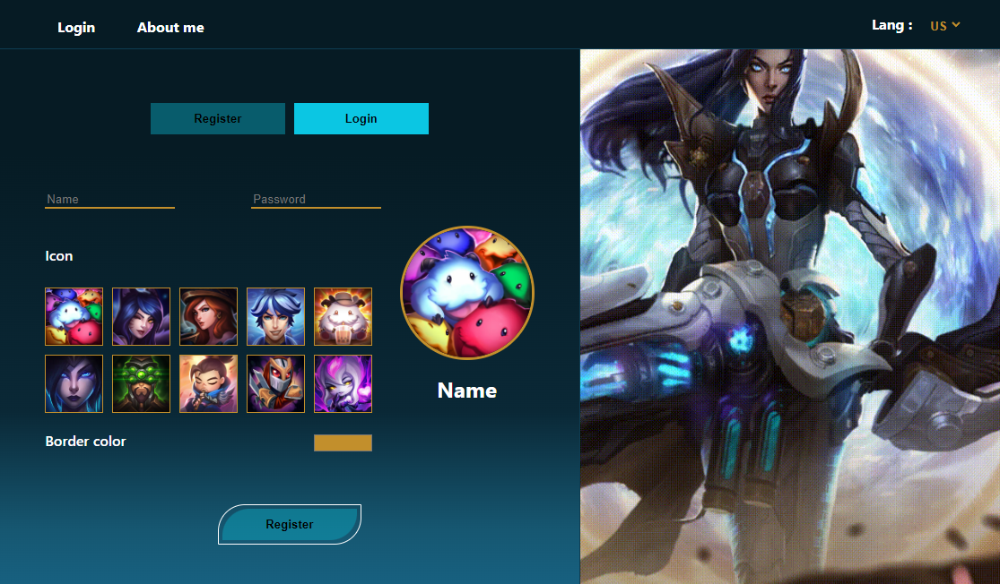
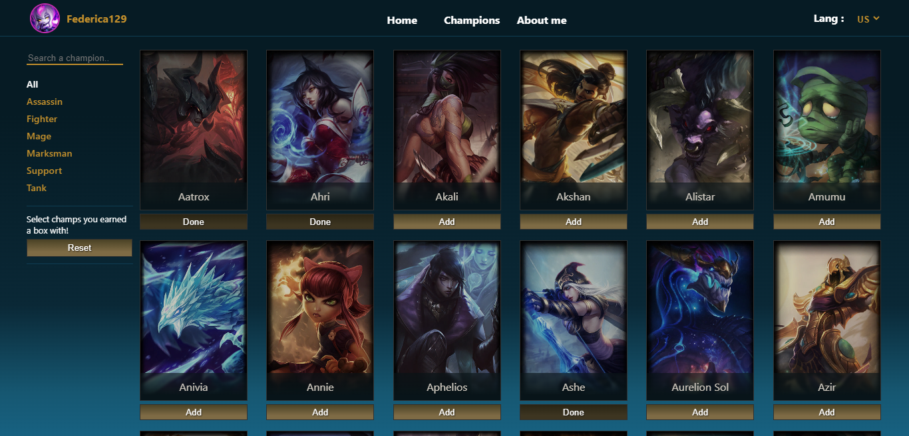
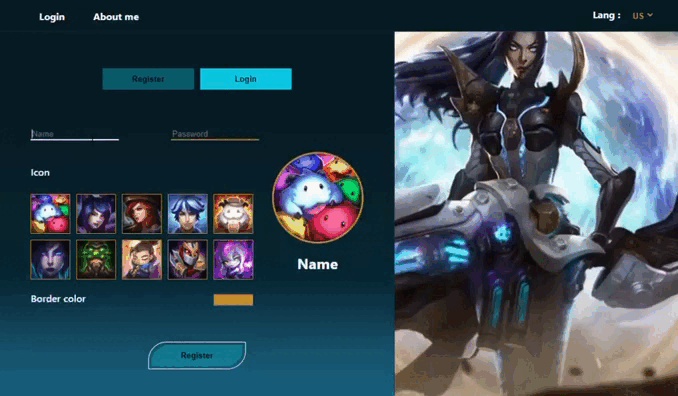
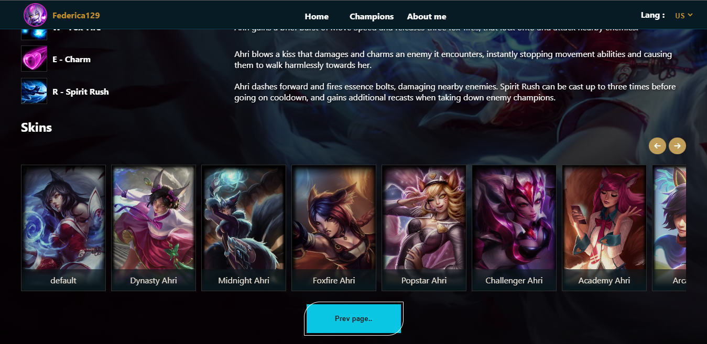
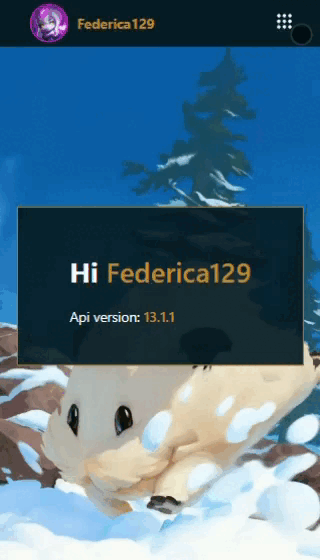
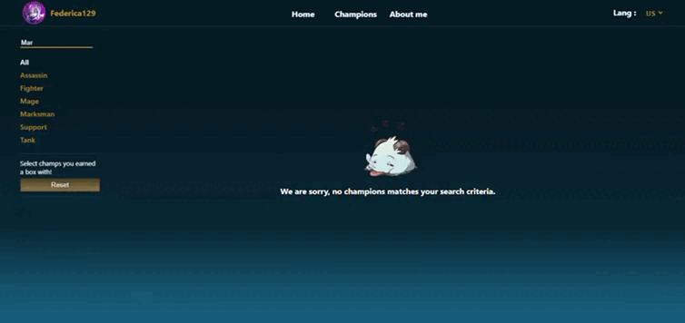
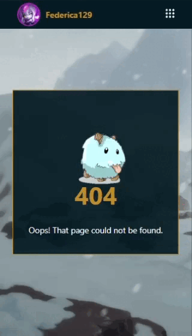

## Getting Started

-Clone repository

-Install and run JSON-SERVER with port 8080 and the development server:

```bash
-Install
npm install json-server

-Run
json-server --watch db.json --port 8080

npm run dev
```

Open [http://localhost:3000](http://localhost:3000) with your browser to see the result.

## Project info

This is a [Next.js](https://nextjs.org/) project with [`create-next-app`](https://github.com/vercel/next.js/tree/canary/packages/create-next-app)., realized to improve, deepen my knowledge and test code as jr.FE developer, realizing a mock as users Database with JSON-SERVER.

I love to play on League Of Legends, so this is the theme of the Project using this API: <a href='https://developer.riotgames.com/docs/lol'>link</a> :P .

<body>
<div align="center" style="display: flex; gap: 20px;  justify-content: center;">


</div>
<br>
The user can in this project:

<li>create an account with a check if the name is valid or existing</li>
<br>
<div align="center" style="display: flex; gap: 20px;  justify-content: center; padding: 20px 0;"">

</div>
<br>
<li>login with valid credentials, else if the credentials don't match with his, it will be shown an error</li>
<li>before of login, can only see page "Access" to Register or to Login and page "About me" (with or without Login)</li>
<li>after login, can navigate in page: <br>

<ol><li>"Home" where show the API version</li>
<li>"Champ" where can see all the champions with or without filter and select them (with button "add") if the user earned a box.. like a list</li>
<li>[name], a page at click of a card in page "Champ" with info (spells, name, skin, eg.) of the selected champion.</li>
<br>
<div align="center" style="display: flex; gap: 20px;  justify-content: center;">

</div></ol>
<li>always after login, can change his icon and save it or logout.</li>
<br>
<div align="center" style="display: flex; gap: 20px;  justify-content: center;">

</div>
<br>
<li>can Delete account in page "Settings"</li>
<li>can see some cute Poro around 👀</li>
<br>
<div align="center" style="display: flex; gap: 20px;  justify-content: center;">


</div>

##

<h3>Technologies:</h3>
<ul>
  <li>HTML</li>
        <li>SASS</li>
        <li>JAVASCRIPT</li>
        <li>NEXT.JS</li>
        <li>TYPESCRIPT (a bit)</li>
</ul>
        <h3>Libraries</h3>
     <ul>
          <li>CSS Modules</li>
          <li>JSON-server <a href='https://www.npmjs.com/package/json-server'>link</a></li>
          <li>React icons <a href='https://react-icons.github.io/react-icons/'>link</a></li>
        </ul>
        
   2022/2023
</body>
